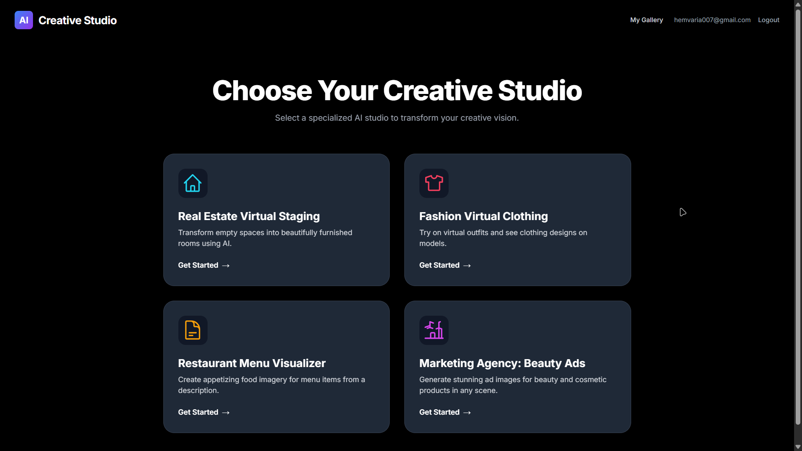
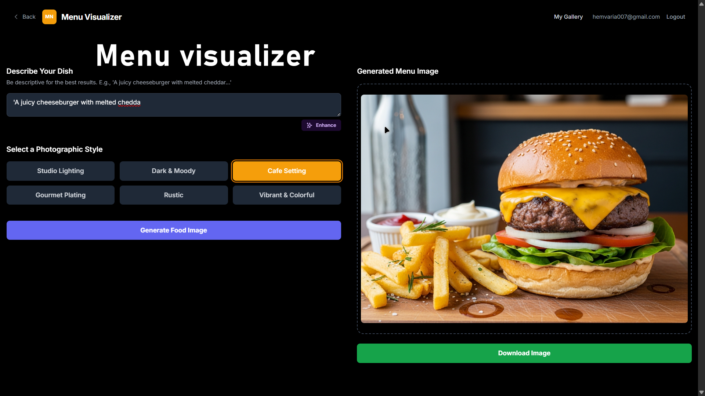

# AI Creative Studio
# AI Creative Studio
#file:thumbnail_aicreativestudio.jpeg

An AI-powered application for generating creative content for various use cases.

## Live Demo

[Open the live app (Google Cloud Run)](https://ai-creative-studio-final-535067068787.us-west1.run.app/)

## Screenshots/Demo

Below are representative images of core flows and generated outputs:





### Project assets

Raw and supplemental assets:
- All image resources folder: `./images/`
- Test sample images used during development: `./test-images/`

## Features List

*   **Authentication:** Secure user login and registration.
*   **Image Generation:** Generate images from text prompts using AI.
*   **Image Gallery:** View a gallery of previously generated images.
*   **Prompt Enhancement:** Improve user prompts for better image generation results.
*   **Specialized Studios:** Dedicated studios for specific use cases like:
    *   Fashion Model Studio
    *   Beauty Ad Studio
    *   Real Estate Studio
    *   Restaurant Studio
    *   Marketing Ad Copy Studio

## Tech Stack

*   **Frontend:** React, TypeScript, Vite
*   **AI:** Google Gemini API
*   **Backend & Database:** Supabase

## Setup Instructions

### 1. Clone the repository

```bash
git clone https://github.com/your-username/ai-creative-studio-final-cloud.git
cd ai-creative-studio-final-cloud
```

### 2. Install dependencies

```bash
npm install
```

### 3. Environment variable setup

Create a `.env.local` file in the root of your project (git-ignored) and add the following environment variables:

```
VITE_SUPABASE_URL=your_supabase_url
VITE_SUPABASE_ANON_KEY=your_supabase_anon_key
VITE_GEMINI_API_KEY=your_gemini_api_key
```

### 4. Run the development server

```bash
npm run dev
```

The application will be available at `http://localhost:5173`.

## API Keys Setup

### Supabase

1.  Go to [Supabase](https://supabase.io/) and create a new project.
2.  In your project dashboard, go to **Settings** > **API**.
3.  You will find your **Project URL** and **Project API keys**. Use the `anon` `public` key for `VITE_SUPABASE_ANON_KEY`.

### Google Gemini

1.  Go to [Google AI Studio](https://aistudio.google.com/) and create a new API key.
2.  Make sure the Gemini API is enabled for your project.
3.  Copy the API key and add it to your `.env` file as `VITE_GEMINI_API_KEY`.

## Challenges & Solutions

*(Describe any challenges you faced during development and how you solved them. For example:)*

*   **Challenge:** Integrating the Gemini API for the first time.
*   **Solution:** Followed the official documentation and created a dedicated service module to handle all API interactions, which made the code cleaner and easier to debug.

*   **Challenge:** Managing application state between different components.
*   **Solution:** Utilized React Context to provide a global state for authentication and user information, avoiding prop drilling.

## Security & Secrets

This project uses client-side environment variables (prefixed with `VITE_`). Anything exposed in the frontend bundle is public, so:

- Never commit real API keys or service credentials; `.env.local` is git-ignored.
- Rotated any previously exposed keys (e.g., Supabase anon key or Gemini key) if they were ever committed.
- For stronger security (row-level policies, rate limiting, key protection) move sensitive operations behind a lightweight server / edge function instead of calling third-party APIs directly from the browser.
- Example env file to create locally:

```bash
cp .env.example .env.local
```

Then populate the values.

## Future Improvements

*(Optional: List some features or improvements you would like to add in the future.)*

*   Implement more advanced prompt engineering techniques.
*   Add more specialized studios for different industries.
*   Allow users to upload their own images for AI-powered editing.
*   Improve the UI/UX of the application.
