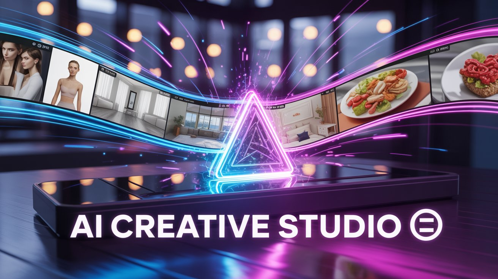
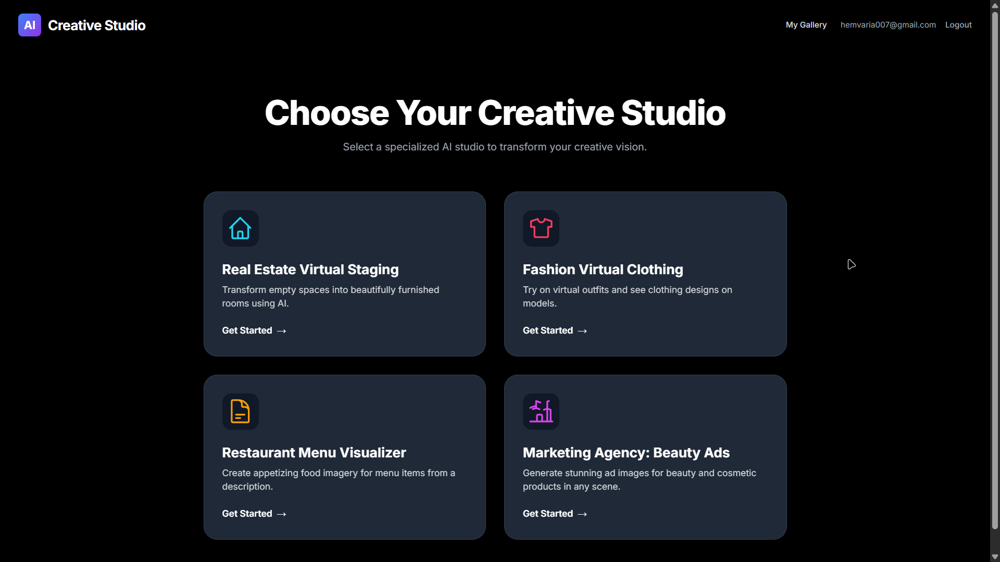
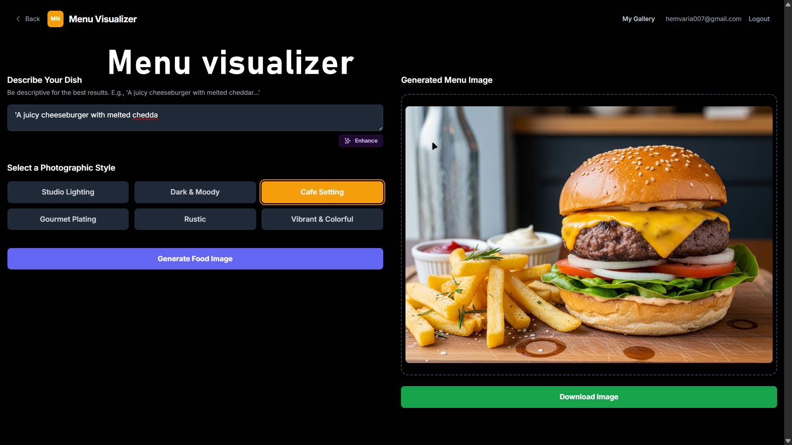
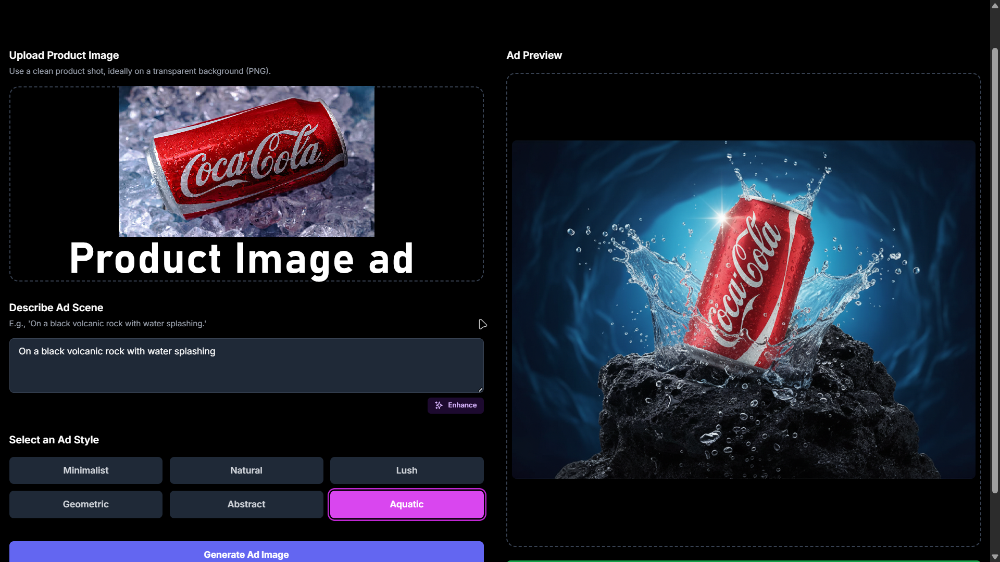

# AI Creative Studio



An AI-powered creative suite for generating professional content across various industries. Built with Next.js 15, Google Gemini 2.0, and Flux.1.

## 🚀 Live Demo

[Open the live app](https://ai-creative-studio-final-535067068787.us-west1.run.app/)

### Demo Video

[](https://youtu.be/J5P3U60t4QE)

## 📸 Screenshots

| Homepage | Menu Visualizer |
|----------|-----------------|
|  |  |

| Virtual Try-On | Product Advertising | Real Estate Staging |
|----------------|---------------------|---------------------|
|  |  |  |

## ✨ Features

*   **Authentication:** Secure user login and registration via Supabase.
*   **Multi-Model AI Pipeline:**
    *   **Google Gemini 2.0 Flash (Experimental):** Used for advanced vision analysis and creative copywriting.
    *   **Flux.1 Schnell:** High-quality image generation for experimental workflows.
    *   **InstructPix2Pix:** Fast image editing for standard workflows.
*   **Specialized Studios:**
    *   **💄 Beauty Ad Studio:** Generate high-end product photography with optional "Vision + Flux" workflow.
    *   **👗 Fashion Model Studio:** Virtual try-on and outfit visualization.
    *   **🏠 Real Estate Studio:** Virtual staging for empty rooms.
    *   **🍽️ Restaurant Studio:** AI food photography and menu visualization.
    *   **📝 Marketing Ad Copy:** Generate compelling copy for your campaigns.
*   **Gallery:** Save and manage your generated assets.

## 🛠️ Tech Stack

*   **Framework:** [Next.js 15](https://nextjs.org/) (App Router)
*   **Language:** TypeScript
*   **Styling:** Tailwind CSS, Framer Motion
*   **AI Models:** 
    *   Google Gemini 2.0 Flash Exp
    *   Black Forest Labs FLUX.1-schnell (via Hugging Face)
    *   Tim Brooks InstructPix2Pix (via Hugging Face)
*   **Backend & Auth:** Supabase

## ⚡ Getting Started

### 1. Clone the repository

```bash
git clone https://github.com/HemVaria/ai-creative-studio.git
cd ai-creative-studio
```

### 2. Install dependencies

```bash
npm install
```

### 3. Environment Setup

Create a `.env.local` file in the root directory and add the following keys:

```env
# Supabase Configuration
NEXT_PUBLIC_SUPABASE_URL=your_supabase_url
NEXT_PUBLIC_SUPABASE_ANON_KEY=your_supabase_anon_key

# AI Service Keys
GOOGLE_GENERATIVE_AI_API_KEY=your_gemini_api_key
HUGGING_FACE_ACCESS_TOKEN=your_hugging_face_token
```

### 4. Run the development server

```bash
npm run dev
```

Open [http://localhost:3000](http://localhost:3000) with your browser to see the result.

## 🔑 API Configuration

### Supabase
1. Create a project at [Supabase](https://supabase.com).
2. Retrieve your URL and Anon Key from Project Settings > API.

### Google Gemini
1. Get your API key from [Google AI Studio](https://aistudio.google.com/).
2. Ensure you have access to `gemini-2.0-flash-exp`.

### Hugging Face
1. Create an account at [Hugging Face](https://huggingface.co).
2. Generate an Access Token (Read permissions) from Settings > Access Tokens.

## 🔒 Security

This project uses server-side actions for sensitive API calls (Gemini, Hugging Face) to keep your API keys secure. Client-side environment variables are strictly limited to public Supabase configuration.

## 🤝 Contributing

Contributions are welcome! Please feel free to submit a Pull Request.